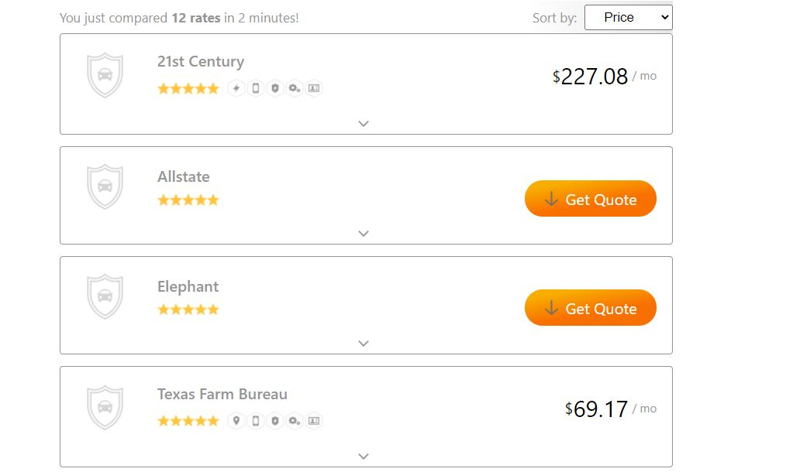

# The Zebra Take Home Assignment - Daniel Pericich

## The Goal

Translate mockup and mock API call provided with assignment into working price comparison tool.

## Technologies used

This app was bootstrapped using CRA (Create React App) and the npm node-sass package to utilize SCSS for component styling with BEM class naming conventions. For testing, I downloaded Enzyme and am using Enzyme with Jest to do unit testing and snapshots for certain components.

## File Structure

The structure of this app is the index.js file as the entry point, with the App.js serving as the main container for all rendered components. All images are stored in the assets directory on the top level of the project. All components are stored in their own directories in the components top level directory. Components as well as their test files are stored in the components folders, as all styling is stored in the sass top level styling directory. Here I utilize the 7-1 SASS architecture approach for my styling files.

## How to use

Clone this repository onto your machine and run "npm install" from the terminal. This will install all dependencies for the project.

## Differences

There were no assets for the icons in the expandable section, so I used the ionicons feature to add these in. For ease of use, I also used ionicons for the chevron up and down for opening and closing the expandable sections. I also used pngs for the button icons, which can be seen with the gray arrows. If I had svgs, I would have changed the fill property to white to match the lettering. I took on the extra sorting challenge and added a functional dropdown to sort by price, rating and alphabetical sorting.

## Testing

I used Jest with Enzyme to do snapshot testing on the InsuranceDescription component. Here I did a shallow rendering of the component as is and with the two props, name and description, to make sure that the elements output by my component were correct. I also tested the quote button prop. For this I checked that it rendered without issue, that it rendered correctly with different props whether an orange or blue button or no button for type 2.
